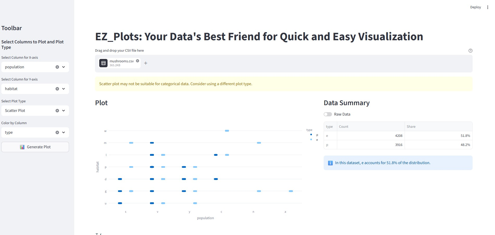
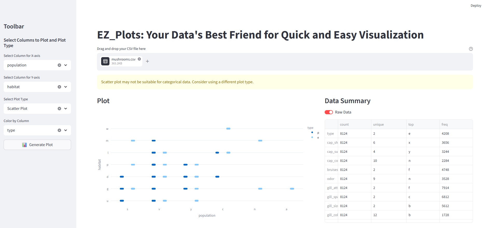
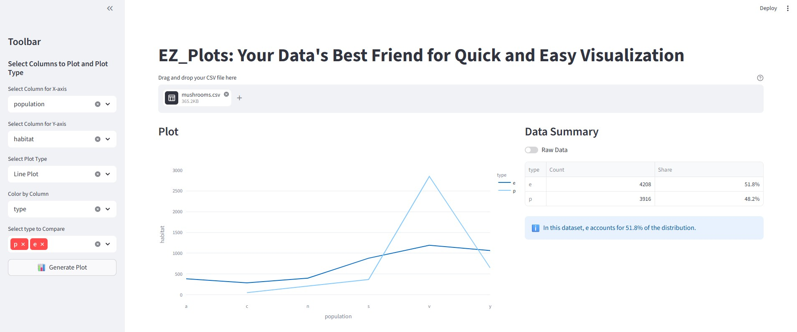
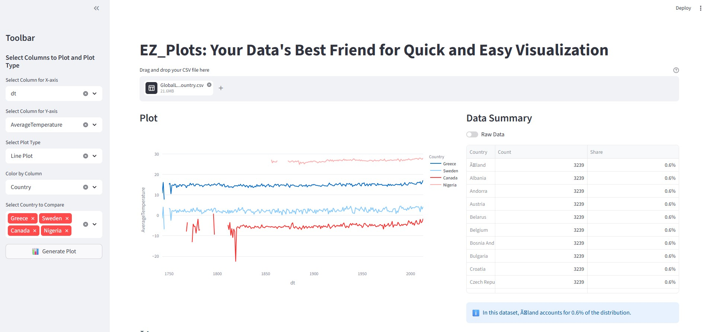
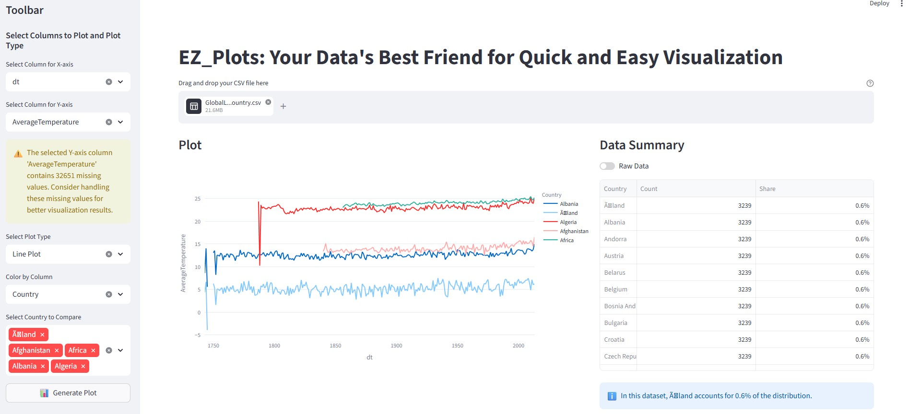

# Adaptive Data Visualizer 📊
A smart Streamlit application designed to turn raw CSV data into meaningful insights through intelligent, automated visualization logic.

🚀 Key Features
1. Intelligent Axis Mapping  
  The app doesn't just list columns; it evaluates them.

👉Smart Time-Detection: Automatically identifies and cleans date columns, handling mixed formats and converting them to a usable year-based axis.

👉Numeric-First UI: To keep the interface clean, the Y-axis prioritizes numeric columns when a date is present, preventing "noisy" categorical data from cluttering the dropdown.

2. Adaptive Aggregation Engine  
The app adjusts its math based on the data types you choose:

👉Numeric Data: Automatically calculates the mean to show trends over time or across categories.

👉Categorical Data: Performs a count to show frequency and distribution (e.g., counting car brands or species).

3. Robust Data Pipeline  
Built with defensive programming principles:

👉Dynamic Grouping: Handles "Color By" selections gracefully, preventing crashes when no category is selected.

👉DRY Logic: Streamlined backend processing ensures that the data is filtered and grouped efficiently without redundant code.

👉Collision Protection: Prevents column name conflicts during aggregation to ensure the chart always renders correctly.

🛠 Tech Stack
Python

Streamlit (UI Framework)

Pandas (Data Processing)

Plotly Express (Interactive Visualization)

📖 How to Use
Upload: Drop in any CSV file.

X-Axis: Select your primary dimension (Dates are automatically detected).

Y-Axis: Select the metric you want to measure.

Color By: (Optional) Pick a categorical column to split your data into multiple lines or colors.

Plot Type: Choose between Line, Scatter (Strip), or Bar plots.

Created with a focus on Split-Apply-Combine logic and user-centric design.

